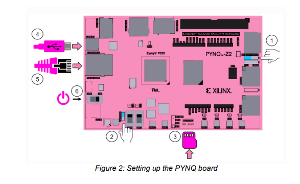
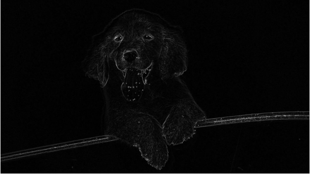
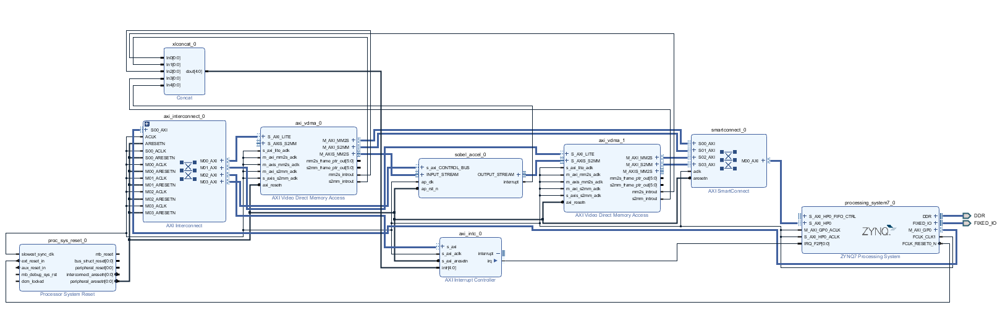
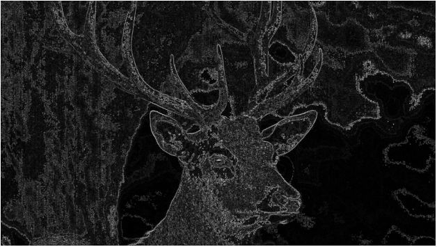

# Image-Edge-Detection-PYNQ 
**Image Edge Detection Sobel Filter Hardware Implementation on PYNQ FPGA Board**

This code was developed for purely academic purposes by **Abhishek Duttagupta** as part of the module of Integrated Systems Design (EE5M01) at Trinity College Dublin. This was inspired by the project: [Image Processing PYNQ](https://github.com/ADG4050/Image-processing-PYNQ).

## PYNQ FPGA Board

PYNQ is an open-source project from Xilinx which integrates software and hardware components for faster development using Zynq devices. PYNQ combines the Python language with FPGA-based Programmable Logic (PL) and an Arm-based Processing System (PS) for building electronic systems. The PYNQ framework allows for user interaction through Jupyter Notebooks.

## Edge Detection in Vivado HLS

1. Add the following files in Vivado HLS from the above GitHub link:
   - `sobel.cpp` and `sobel.h` as Design Files
   - Set `sobel_accel` as the top function
   - Add `tb_sobel.cpp` as the TestBench File.

2. Select the `pynq-z2` board by clicking the 3 dots next to Part Selection. 
   - Note: If you cannot find the PYNQ-Z2 board, navigate to `C:/Xilinx/Vivado/2019.2/data/boards/board_files` and ensure the pynq-z2 board files are present.

3. Run **C Synthesis** by clicking the green ‘play’ button in the toolbar. Information such as the timing, latency, and utilization of the FPGA resources will be displayed at the end.

4. Upload the desired image in the testbench code. Open `tb_sobel.cpp` and edit the file paths of the source image and the filter output.
   - To run the TestBench, select **C/RTL Cosimulation**. The result will be available in the directory afterward.

5. Export the RTL by clicking **Solution → Export RTL**.

## Hardware Implementation in Vivado PYNQ Board

An Overlay is created in Vivado with the following IPs:

- ZYNQ7 Processing System
- AXI Video Direct Memory Access (x2)
- Processor System Reset
- Concat
- AXI Interrupt Controller
- AXI Interconnect
- AXI Smart Connect

The Sobel IP is added from the HLS directory that was exported.

An HDL Wrapper is created around the source design, and the bitstream is exported (`.bit` and `.hwh` files for Jupyter notebook implementation in PYNQ).

The `.bit` & `.hwh` files are uploaded to Jupyter, and hardware implementation is processed using the code in the Jupyter notebook (`pynq.ipynb`).

## Final Output

## Contact

For queries, contact **aduttagu@tcd.ie**.
